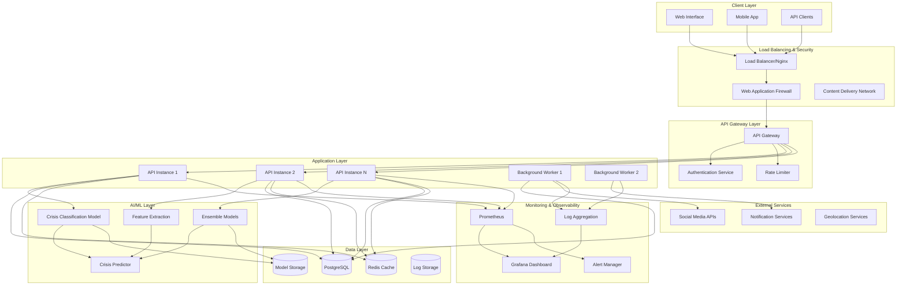
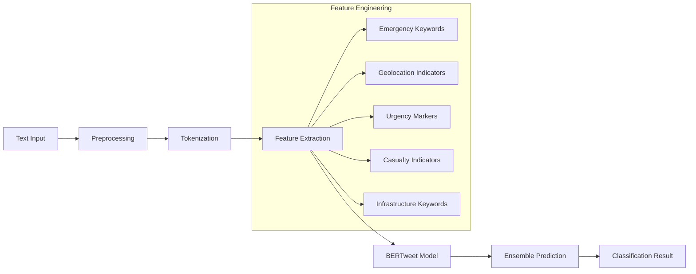
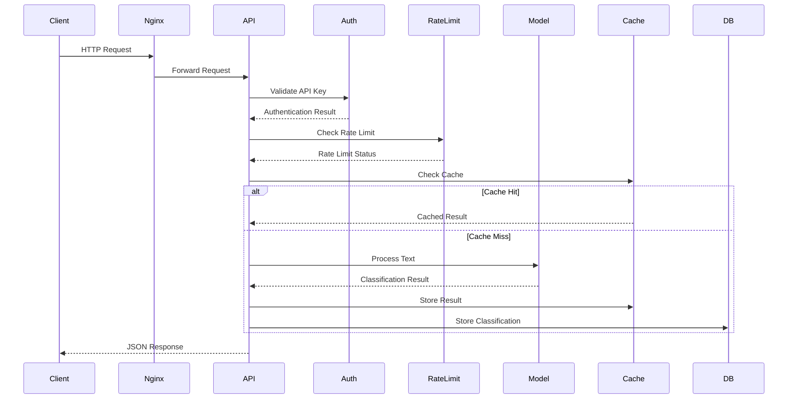
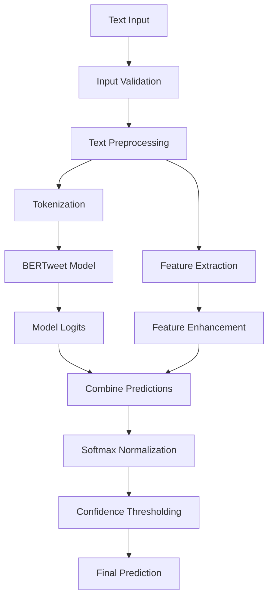
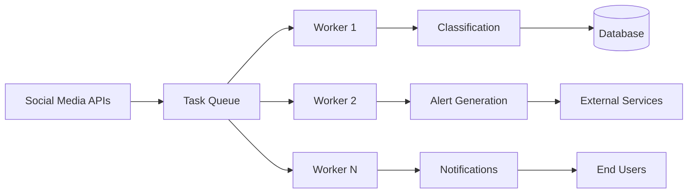
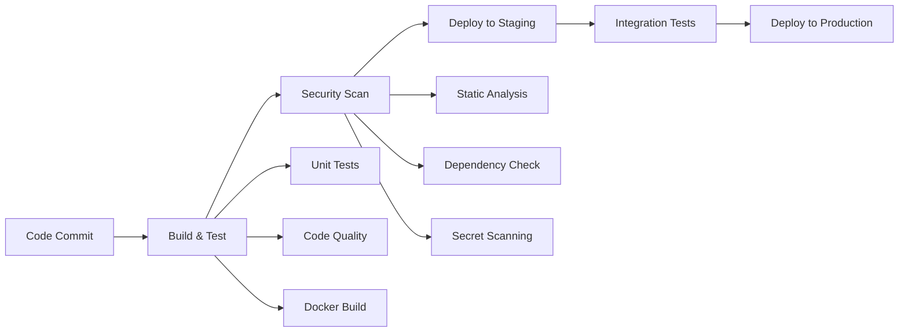

# AICrisisAlert System Architecture

## Overview

AICrisisAlert is a distributed, microservices-based crisis management system designed for real-time social media monitoring and emergency response coordination. The architecture prioritizes scalability, reliability, and security for mission-critical emergency management scenarios.

## System Architecture Diagram



## Core Components

### 1. API Gateway Layer

**FastAPI Application Server**
- **Purpose**: Primary REST API for crisis classification
- **Technology**: FastAPI with Pydantic validation
- **Features**:
  - Bearer token authentication
  - Rate limiting (100 requests/hour)
  - Input validation and sanitization
  - Request/response logging
  - Health monitoring endpoints

**Authentication & Authorization**
- **Method**: Bearer token (API key) authentication
- **Security**: 32-character cryptographic keys
- **Rate Limiting**: Per-key request throttling
- **Input Validation**: XSS and injection prevention

### 2. AI/ML Processing Layer

**Crisis Classification Pipeline**


**Model Components**:
- **Primary Model**: Fine-tuned BERTweet for social media text
- **Feature Extractor**: Crisis-specific feature engineering
- **Ensemble System**: Multiple model voting with confidence weighting
- **Predictor**: Unified prediction interface with async processing

**Crisis Categories**:
1. `urgent_help` - Immediate assistance requests
2. `infrastructure_damage` - Infrastructure status reports
3. `casualty_info` - Injury/casualty information
4. `resource_availability` - Available resources/volunteers
5. `general_info` - General crisis information

### 3. Data Storage Layer

**PostgreSQL Database**
- **Purpose**: Persistent storage for classifications and metadata
- **Schema**: Normalized design with proper indexing
- **Features**:
  - ACID compliance for data integrity
  - Connection pooling (20 connections, 40 overflow)
  - Automated backups and point-in-time recovery
  - Read replicas for scaling

**Database Schema**:
```sql
-- Core classification storage
CREATE TABLE classifications (
    id UUID PRIMARY KEY,
    text TEXT NOT NULL,
    category VARCHAR(50) NOT NULL,
    confidence FLOAT NOT NULL,
    model_name VARCHAR(100) NOT NULL,
    processing_time_ms FLOAT,
    created_at TIMESTAMP DEFAULT NOW(),
    -- Location and metadata
    location_extracted TEXT,
    latitude FLOAT,
    longitude FLOAT,
    source_platform VARCHAR(50),
    urgency_score FLOAT,
    verified BOOLEAN DEFAULT FALSE
);

-- Feature storage for analysis
CREATE TABLE extracted_features (
    id SERIAL PRIMARY KEY,
    classification_id UUID REFERENCES classifications(id),
    emergency_keywords_count INTEGER DEFAULT 0,
    location_mentions_count INTEGER DEFAULT 0,
    urgency_indicators_count INTEGER DEFAULT 0,
    features_json TEXT
);

-- Alert management
CREATE TABLE alerts (
    id UUID PRIMARY KEY,
    classification_id UUID REFERENCES classifications(id),
    alert_type VARCHAR(50) NOT NULL,
    severity VARCHAR(20) NOT NULL,
    status VARCHAR(50) DEFAULT 'pending',
    created_at TIMESTAMP DEFAULT NOW()
);
```

**Redis Caching Layer**
- **Purpose**: High-performance caching and session storage
- **Use Cases**:
  - Model prediction caching
  - Rate limiting counters
  - Session management
  - Real-time analytics
- **Configuration**: LRU eviction, persistence enabled

### 4. Background Processing

**Celery Task Queue**
- **Purpose**: Asynchronous background tasks
- **Broker**: Redis for task queuing
- **Tasks**:
  - Batch processing of social media feeds
  - Model retraining automation
  - Alert notification dispatch
  - Data cleanup and archival

**Task Examples**:
```python
@celery.task
def process_social_media_batch(posts):
    """Process large batches of social media posts"""
    results = []
    for post in posts:
        result = classify_crisis_text(post.text)
        results.append(result)
    return results

@celery.task
def retrain_model_periodic():
    """Periodic model retraining with new data"""
    new_data = fetch_validated_data()
    if len(new_data) > RETRAIN_THRESHOLD:
        trigger_model_training(new_data)
```

## Data Flow Architecture

### 1. Request Processing Flow



### 2. Model Inference Flow



### 3. Background Processing Flow



## Scalability Architecture

### 1. Horizontal Scaling

**API Layer Scaling**:
```yaml
# Docker Compose scaling
services:
  api:
    deploy:
      replicas: 3
      resources:
        limits:
          cpus: '1.0'
          memory: 2G
      restart_policy:
        condition: on-failure
```

**Database Scaling**:
- **Read Replicas**: Separate read and write operations
- **Connection Pooling**: PgBouncer for connection management
- **Partitioning**: Time-based partitioning for large tables

**Caching Strategy**:
- **L1 Cache**: In-memory application cache
- **L2 Cache**: Redis distributed cache
- **CDN**: Static content caching

### 2. Load Balancing

**Nginx Configuration**:
```nginx
upstream aicrisisalert_backend {
    least_conn;
    server api1:8000 weight=1;
    server api2:8000 weight=1;
    server api3:8000 weight=1;
    
    # Health checks
    keepalive 32;
}
```

**Health Monitoring**:
- Automatic failover for unhealthy instances
- Circuit breaker pattern for external services
- Graceful degradation under high load

### 3. Auto-scaling (AWS/Kubernetes)

**ECS Auto-scaling**:
```json
{
  "scalingPolicy": {
    "targetTrackingScalingPolicies": [
      {
        "targetValue": 70.0,
        "scaleOutCooldown": 300,
        "scaleInCooldown": 300,
        "metricType": "CPUUtilization"
      }
    ]
  }
}
```

## Security Architecture

### 1. Defense in Depth

**Layer 1: Network Security**
- VPC with private subnets
- Security groups with minimal access
- Network ACLs for additional filtering
- VPN/Bastion hosts for administrative access

**Layer 2: Application Security**
- Bearer token authentication
- Input validation and sanitization
- Rate limiting and DDoS protection
- CORS with explicit origin allowlist

**Layer 3: Data Security**
- Encryption at rest (AES-256)
- Encryption in transit (TLS 1.3)
- Database connection encryption
- Secrets management (AWS Secrets Manager)

### 2. Security Controls

**Authentication & Authorization**:
```python
# Multi-layered security implementation
@app.middleware("http")
async def security_middleware(request: Request, call_next):
    # Rate limiting
    if not check_rate_limit(request.client.host):
        raise HTTPException(429, "Rate limit exceeded")
    
    # Input validation
    if not validate_input_safety(request):
        raise HTTPException(400, "Invalid input")
    
    response = await call_next(request)
    
    # Security headers
    response.headers["X-Content-Type-Options"] = "nosniff"
    response.headers["X-Frame-Options"] = "DENY"
    response.headers["X-XSS-Protection"] = "1; mode=block"
    
    return response
```

**Data Protection**:
- Personal data anonymization
- Audit logging for all access
- Data retention policies
- GDPR compliance measures

### 3. Threat Modeling

**Identified Threats**:
1. **API Abuse**: Rate limiting and authentication
2. **Injection Attacks**: Input validation and parameterized queries
3. **Data Breaches**: Encryption and access controls
4. **Model Poisoning**: Input sanitization and model validation
5. **DDoS Attacks**: Load balancing and CDN protection

## Deployment Architecture

### 1. Environment Strategy

**Development Environment**:
- Local Docker Compose setup
- Mock services for external dependencies
- Hot-reload for rapid development
- Comprehensive test coverage

**Staging Environment**:
- Production-like infrastructure
- Real external service integration
- Performance testing environment
- Security scanning and validation

**Production Environment**:
- High availability deployment
- Auto-scaling and load balancing
- Monitoring and alerting
- Disaster recovery procedures

### 2. CI/CD Pipeline



### 3. Infrastructure as Code

**Terraform Modules**:
```hcl
module "aicrisisalert" {
  source = "./modules/aicrisisalert"
  
  environment = "production"
  vpc_cidr = "10.0.0.0/16"
  
  # Database configuration
  db_instance_class = "db.r5.xlarge"
  db_allocated_storage = 100
  
  # API configuration
  api_instance_count = 3
  api_cpu = 1024
  api_memory = 2048
  
  # Security configuration
  enable_waf = true
  enable_cloudtrail = true
}
```

## Monitoring & Observability

### 1. Metrics Collection

**Prometheus Metrics**:
```python
# Custom metrics for business logic
from prometheus_client import Counter, Histogram, Gauge

# Request metrics
request_count = Counter('api_requests_total', 'Total API requests', ['method', 'endpoint'])
request_duration = Histogram('api_request_duration_seconds', 'Request duration')

# Business metrics
classifications_total = Counter('classifications_total', 'Total classifications', ['category'])
model_confidence = Histogram('model_confidence', 'Model confidence scores')
classification_latency = Histogram('classification_latency_seconds', 'Classification processing time')

# System metrics
active_connections = Gauge('database_connections_active', 'Active database connections')
cache_hit_rate = Gauge('cache_hit_rate', 'Cache hit rate percentage')
```

**Key Performance Indicators**:
- Classification accuracy and confidence
- API response times and error rates
- System resource utilization
- User engagement and adoption metrics

### 2. Logging Strategy

**Structured Logging**:
```python
import structlog

logger = structlog.get_logger()

# Structured log entries
logger.info(
    "classification_completed",
    user_id=user_id,
    text_length=len(text),
    predicted_class=result.predicted_class,
    confidence=result.confidence,
    processing_time_ms=processing_time,
    model_version=model_version
)
```

**Log Aggregation**:
- Centralized logging with ELK stack
- Log retention policies
- Real-time alerting on error patterns
- Security audit trails

### 3. Alerting

**Alert Rules**:
```yaml
# Prometheus alerting rules
groups:
  - name: aicrisisalert
    rules:
      - alert: HighErrorRate
        expr: rate(api_requests_total{status=~"5.."}[5m]) > 0.1
        for: 2m
        labels:
          severity: critical
        annotations:
          summary: "High error rate detected"
          
      - alert: ModelPredictionLatency
        expr: classification_latency_seconds{quantile="0.95"} > 2
        for: 1m
        labels:
          severity: warning
        annotations:
          summary: "Model prediction latency is high"
```

## Disaster Recovery & Business Continuity

### 1. Backup Strategy

**Database Backups**:
- Automated daily full backups
- Continuous transaction log shipping
- Point-in-time recovery capability
- Cross-region backup replication

**Model Backups**:
- Versioned model storage in S3
- Training data backups
- Configuration backups
- Regular backup validation

### 2. High Availability

**Multi-AZ Deployment**:
- Database replication across availability zones
- Load balancer health checks
- Automatic failover procedures
- Zero-downtime deployment strategies

**Recovery Procedures**:
```bash
# Automated failover script
#!/bin/bash
if ! curl -f http://primary-api/health; then
    # Switch to backup region
    aws route53 change-resource-record-sets \
        --hosted-zone-id $ZONE_ID \
        --change-batch file://failover-dns.json
    
    # Scale up backup region
    aws ecs update-service \
        --cluster backup-cluster \
        --service aicrisisalert-service \
        --desired-count 3
fi
```

### 3. Recovery Time Objectives

- **RTO (Recovery Time Objective)**: < 15 minutes
- **RPO (Recovery Point Objective)**: < 5 minutes
- **Data Loss Tolerance**: Minimal (< 1 minute)
- **Availability Target**: 99.9% uptime

## Performance Characteristics

### 1. Latency Requirements

| Operation | Target Latency | Maximum Latency |
|-----------|---------------|-----------------|
| Health Check | < 10ms | 100ms |
| Single Classification | < 300ms | 2s |
| Batch Classification | < 200ms/item | 5s total |
| Emergency Classification | < 200ms | 1s |

### 2. Throughput Capacity

| Metric | Current Capacity | Maximum Capacity |
|--------|------------------|------------------|
| Requests/second | 100 RPS | 1000 RPS |
| Classifications/hour | 360,000 | 3,600,000 |
| Concurrent Users | 100 | 1000 |
| Database Connections | 20 | 100 |

### 3. Resource Utilization

**CPU Usage**:
- Normal: 30-50%
- Peak: 70-80%
- Alert Threshold: > 85%

**Memory Usage**:
- API Instances: 1-2GB per instance
- Database: 4-8GB for working set
- Redis Cache: 512MB-2GB

**Storage**:
- Database growth: ~1GB/month
- Model storage: ~2GB per version
- Log retention: 30 days (~10GB)

This architecture provides a robust, scalable, and secure foundation for the AICrisisAlert system, capable of handling real-time crisis classification at scale while maintaining high availability and data integrity.